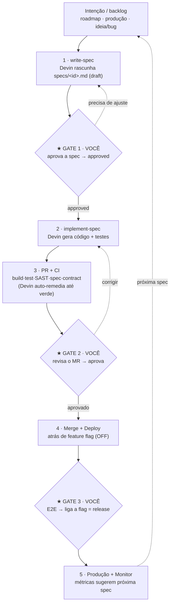

# Fluxo do Loop AI-Native — como dirigir o Devin e onde você atua

Referência de processo do ResponsabiliMano. Complementa
`docs/plano-ai-native-sdlc.md` (o plano) e `.devin/` (as rules/workflows).

## Modelo mental (uma frase)

Você **expressa a intenção**, o Devin **rascunha a spec e produz** código+testes,
e você **cura em 3 gates**. Você nunca escreve a spec do zero nem digita o código.

## O ciclo contínuo

- **Amarelo (gates) = você.** Azul = Devin. Cinza = CI. Verde = produção.
- Entre o Gate 1 e o Gate 2 o Devin roda **sozinho** (gerar, PR, CI, remediar).

## Quem cria a próxima spec?

Você **dispara**, o Devin **redige**. Fluxo: você dá a intenção → o Devin roda o
workflow `.devin/workflows/write-spec.md` e cria `specs/<id>.md` em `draft` →
você revisa e muda para `approved` (Gate 1). O Devin **propõe**; nunca
auto-aprova.

### De onde vêm as intenções quando o backlog acaba

1. **Roadmap / PRD** — próximas capacidades planejadas (`docs/plan.md`,
   `docs/prd.md`). Ex.: Sprint 4 (dashboard), Sprint 5 (polimento).
2. **Monitoramento de produção** — com os health checks/observabilidade (R8),
   métricas e anomalias viram specs de melhoria. É o passo 5 → próxima spec.
3. **Ideias ou bugs** ad-hoc que você levanta (viram specs `S*`/`X*`).

## Quando o trabalho é maior que uma spec

Vista o chapéu de **Feature Lead** por alguns minutos antes de gerar: peça ao
Devin um **brief da feature** + a **decomposição em specs atômicas** (uma por
iteração de 2–3 dias) e os **contratos** entre elas. Depois rode cada spec pelo
loop. Governança escala com o tamanho (Tenet 7): mudança pequena = uma spec;
feature = brief + várias specs; nada de processo pesado por padrão.

## Regras invioláveis (já codificadas em `.devin/rules/`)

- **Sem spec `approved`, sem código** (`spec-driven.md`). O Devin para no Gate 1.
- **Sem sua aprovação, sem merge** (`quality-gates.md` + `review-and-merge.md`).
  O Devin para no Gate 2 com o CI verde.

## Playbook de prompts (o que você diz ao Devin)

| Momento | Exemplo de comando |
|---|---|
| **Nova feature** | "Vamos iniciar a Sprint 4 (dashboard). Rode write-spec: gere o brief e decomponha em specs atômicas com contratos. Não implemente ainda." |
| **Nova spec isolada** | "Rode write-spec para: exportar histórico de check-ins em CSV. Deixe em draft para eu revisar." |
| **Aprovar (Gate 1)** | "A spec S4.1 está boa; ajuste os critérios 2 e 3 como comentei e marque status: approved." |
| **Implementar** | "Implemente a spec S4.1 (workflow implement-spec). Pare no PR para minha revisão." |
| **Aprovar MR (Gate 2)** | "Revisei o PR #NN: testes cobrem os edge cases e a validação está ok. Aprovado — merge e deploy atrás da flag." |
| **Pedir correção** | "No PR #NN, o teste X não exercita o caso de borda Y. Ajuste e re-suba." |
| **Aceitar feature (Gate 3)** | "E2E passou em staging. Ligue a flag `Dashboard` e marque as specs como done." |
| **Do monitoramento** | "A latência do dashboard passou de 800ms no p95. Rode write-spec para uma spec de otimização." |

## Seu tempo por iteração (referência)

| Gate | Frequência | Esforço |
|---|---|---|
| Gate 1 (aprovar spec) | 1×/spec | ~15–30 min |
| Gate 2 (aprovar MR) | 1×/spec | ~30–60 min |
| Gate 3 (aceitar feature) | 1×/feature | variável (E2E) |

Todo o resto — rascunho da spec, geração, PR, CI, auto-remediação, deploy — é
autônomo. Se o **AI First-Pass** cair (muitos PRs precisando de conserto), o
problema quase sempre é **spec ambígua**: invista no Gate 1, não em revisar mais
código.
